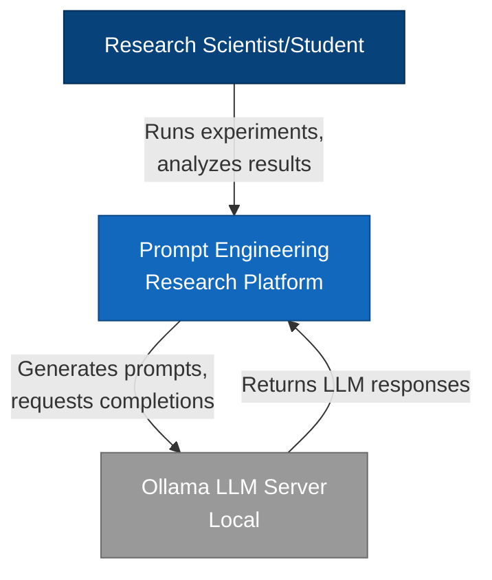
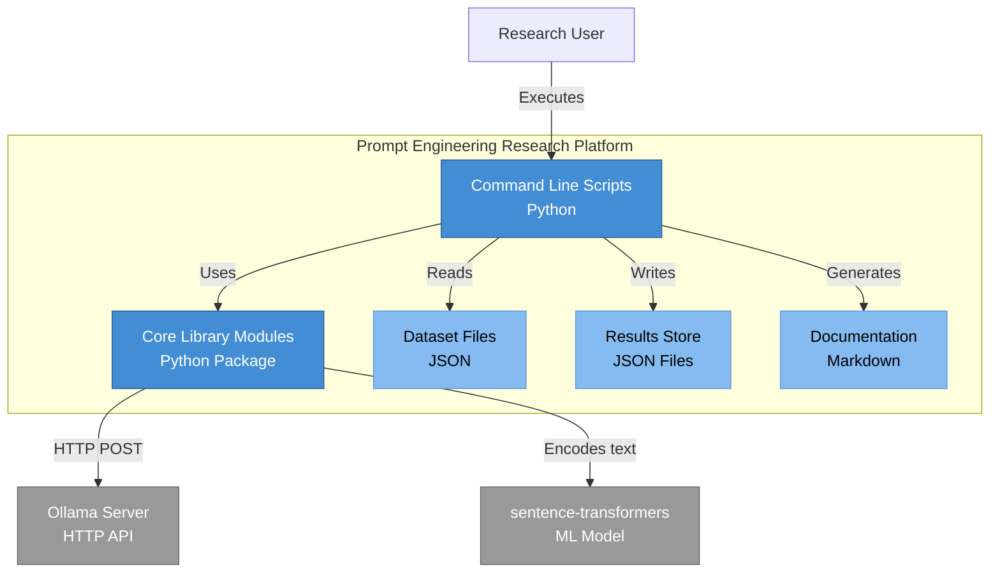
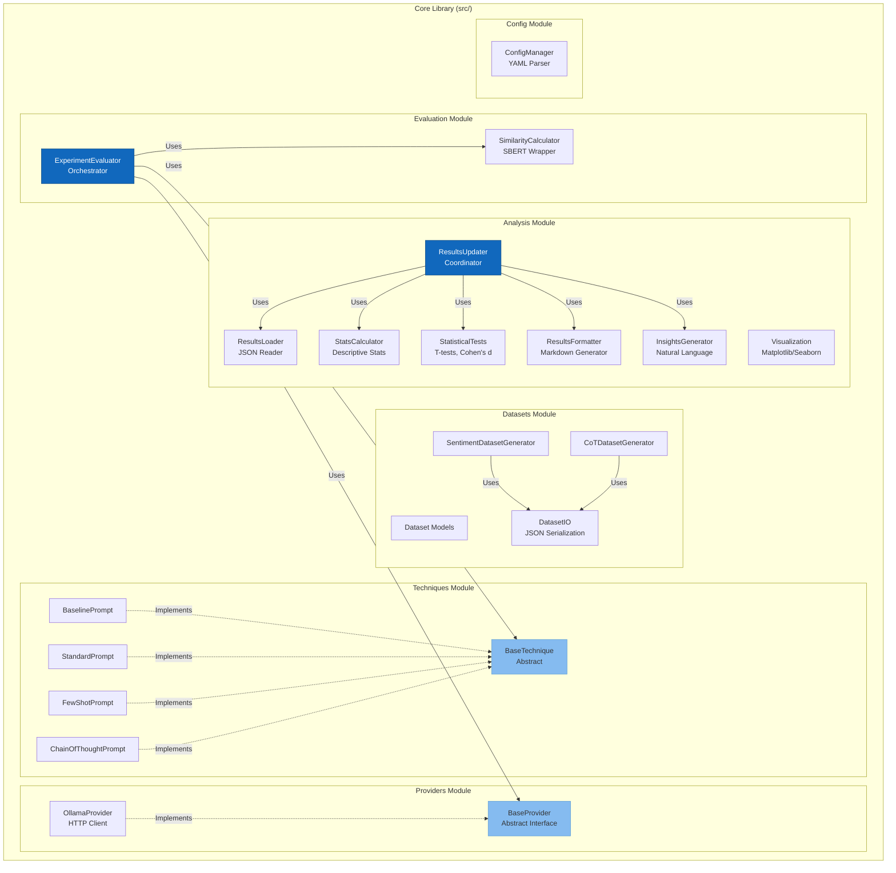
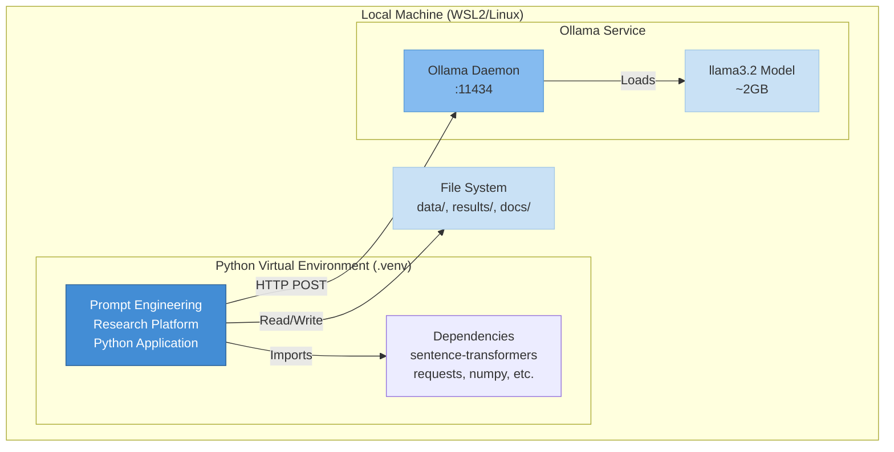
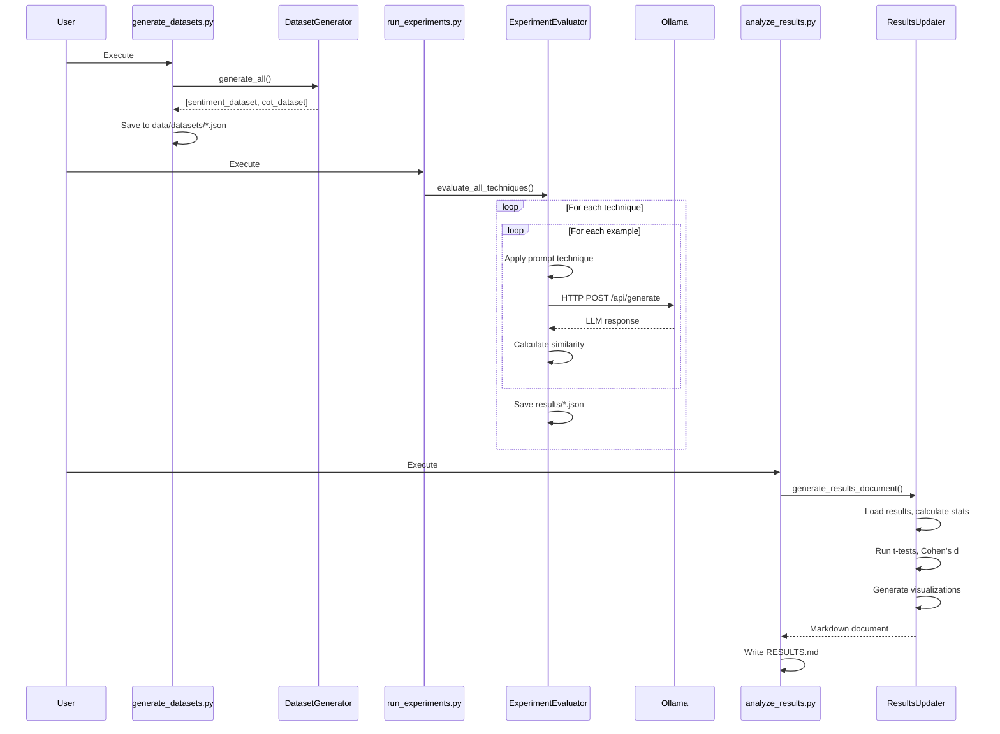

# C4 Model Architecture Documentation

**Project:** Prompt Engineering Research Platform
**Version:** 1.0
**Date:** December 16, 2025
**Author:** Tal Hibner

---

## Overview

This document describes the system architecture using the C4 (Context, Container, Component, Code) model. The C4 model provides a hierarchical set of architecture diagrams for different levels of abstraction.

---

## Level 1: System Context Diagram

Shows how the system fits into the broader environment and interacts with users and external systems.



**Description:**
- **Research Scientist/Student**: Primary user conducting prompt engineering experiments
- **Prompt Engineering Research Platform**: The system being described (this codebase)
- **Ollama LLM Server**: Local LLM inference engine (llama3.2 model)

**Key Interactions:**
1. User executes experiment scripts
2. System generates prompts using various techniques
3. System queries Ollama for LLM completions
4. System evaluates responses and generates statistical analyses

---

## Level 2: Container Diagram

Shows the major containers (applications, data stores, microservices) that make up the system.



**Containers:**

1. **Command Line Scripts** (Python)
   - Entry points for dataset generation, experiments, analysis
   - Technology: Python 3.10+, UV package manager
   - Files: `scripts/generate_datasets.py`, `scripts/run_experiments.py`, `scripts/analyze_results.py`

2. **Core Library Modules** (Python Package)
   - Reusable modules for providers, techniques, evaluation, analysis
   - Technology: Python package with modular architecture
   - Directory: `src/`

3. **Dataset Files** (JSON)
   - Sentiment analysis and chain-of-thought test datasets
   - Format: JSON with structured examples
   - Directory: `data/datasets/`

4. **Results Store** (JSON Files)
   - Experimental results with similarity scores and metadata
   - Format: JSON with technique-specific results
   - Directory: `results/experiments/`

5. **Documentation** (Markdown)
   - Auto-generated analysis reports and static docs
   - Format: GitHub-flavored Markdown
   - Files: `RESULTS.md`, `docs/*.md`

**External Dependencies:**
- **Ollama Server**: Local LLM inference (HTTP API on port 11434)
- **sentence-transformers**: Pre-trained embedding model for similarity

---

## Level 3: Component Diagram - Core Library

Shows the internal structure of the Core Library container.



**Component Responsibilities:**

### Providers Module (`src/providers/`)
- **BaseProvider**: Abstract interface defining LLM provider contract
- **OllamaProvider**: Concrete implementation for Ollama HTTP API
- **Future**: ClaudeProvider, GeminiProvider, OpenAIProvider (implemented but not used)

### Techniques Module (`src/techniques/`)
- **BaseTechnique**: Abstract base for prompt engineering techniques
- **BaselinePrompt**: Direct question (control group)
- **StandardPrompt**: Enhanced with role and structure
- **FewShotPrompt**: Includes 2-3 demonstration examples
- **ChainOfThoughtPrompt**: Requests step-by-step reasoning

### Datasets Module (`src/datasets/`)
- **DatasetBase**: Data models (Dataset, DatasetExample)
- **SentimentDatasetGenerator**: Creates 40 sentiment classification examples
- **CoTDatasetGenerator**: Creates 8 multi-step reasoning problems
- **DatasetIO**: JSON serialization/deserialization

### Evaluation Module (`src/evaluation/`)
- **ExperimentEvaluator**: Orchestrates experiment execution
  - Loads datasets
  - Applies techniques
  - Queries LLM
  - Calculates similarity scores
  - Saves results
- **SimilarityCalculator**: Wrapper around sentence-transformers
  - Encodes text to embeddings
  - Computes cosine similarity

### Analysis Module (`src/analysis/`)
- **ResultsUpdater**: Main coordinator for report generation
- **ResultsLoader**: Loads JSON result files
- **StatsCalculator**: Computes mean, std, improvements
- **StatisticalTests**: T-tests, Cohen's d, p-values
- **ResultsFormatter**: Generates markdown tables
- **InsightsGenerator**: Creates natural language insights
- **Visualization**: Creates plots (box plots, bar charts, heatmaps)

### Config Module (`src/config/`)
- **ConfigManager**: Parses config.yaml, manages settings

---

## Level 4: Code - Key Algorithms

### Similarity Calculation Flow

```python
# 1. Load sentence-transformers model
model = SentenceTransformer('all-MiniLM-L6-v2')

# 2. Encode texts to embeddings
embedding1 = model.encode(text1)  # Shape: (384,)
embedding2 = model.encode(text2)  # Shape: (384,)

# 3. Compute cosine similarity
similarity = cosine_similarity([embedding1], [embedding2])[0][0]  # Range: [0, 1]
```

### Experiment Execution Flow

```python
# For each dataset example:
for example in dataset.examples:
    # 1. Apply prompt technique
    prompt = technique.apply(example.question, context)

    # 2. Get LLM response
    response = provider.generate(prompt)

    # 3. Calculate similarity to expected answer
    score = similarity_calculator.calculate(
        response,
        example.expected_answer
    )

    # 4. Store result
    results.append({
        "question": example.question,
        "response": response,
        "similarity": score,
        "technique": technique.name
    })
```

### Statistical Comparison Algorithm

```python
# Cohen's d effect size calculation
def cohens_d(scores1: List[float], scores2: List[float]) -> float:
    mean1, mean2 = np.mean(scores1), np.mean(scores2)
    std1, std2 = np.std(scores1, ddof=1), np.std(scores2, ddof=1)
    n1, n2 = len(scores1), len(scores2)

    # Pooled standard deviation
    pooled_std = np.sqrt(
        ((n1-1)*std1**2 + (n2-1)*std2**2) / (n1+n2-2)
    )

    # Effect size
    return (mean2 - mean1) / pooled_std

# Interpretation:
# |d| < 0.2: negligible
# |d| < 0.5: small
# |d| < 0.8: medium
# |d| >= 0.8: large
```

---

## Deployment Diagram

Shows how the system is deployed in the runtime environment.



**Deployment Details:**

- **Platform**: Linux (WSL2 on Windows) / Native Linux
- **Python Version**: 3.10+
- **Package Manager**: UV (fast Python package installer)
- **Virtual Environment**: `.venv/` directory
- **Ollama Service**:
  - Port: 11434
  - Model: llama3.2
  - Start: `ollama serve`
- **File System**:
  - `data/datasets/`: Input datasets
  - `results/experiments/`: Experimental outputs
  - `docs/`: Documentation
  - `src/`: Source code
  - `tests/`: Unit tests

---

## Data Flow Diagram

End-to-end data flow through the system.



---

## Design Principles

### 1. Modularity
- **Single Responsibility**: Each module has one clear purpose
- **Separation of Concerns**: Data, logic, presentation separated
- **File Size Limit**: All files <150 lines for maintainability

### 2. Abstraction
- **Provider Interface**: Abstract `BaseProvider` allows swapping LLM backends
- **Technique Interface**: Abstract `BaseTechnique` enables new prompt strategies
- **Dependency Injection**: Evaluator receives providers/techniques as parameters

### 3. Testability
- **Mock-Friendly Design**: External dependencies (HTTP, ML models) are mockable
- **Pure Functions**: Statistical calculations are stateless
- **Fixtures**: Shared test data via pytest fixtures

### 4. Reproducibility
- **Local Execution**: Ollama eliminates API variability
- **Version Pinning**: Dependencies locked in pyproject.toml
- **Deterministic Embeddings**: Same model version for all experiments

### 5. Extensibility
- **New Providers**: Implement `BaseProvider` interface
- **New Techniques**: Implement `BaseTechnique` interface
- **New Datasets**: Extend `DatasetGenerator`
- **New Metrics**: Add to `SimilarityCalculator` or create new evaluator

---

## Technology Stack

### Core Technologies
- **Language**: Python 3.10+
- **Package Manager**: UV (replaces pip/poetry)
- **Testing**: pytest, pytest-cov
- **LLM Backend**: Ollama (llama3.2 model)

### Key Libraries
- **sentence-transformers**: Semantic similarity (all-MiniLM-L6-v2)
- **numpy**: Numerical computations
- **scipy**: Statistical tests (t-test)
- **matplotlib/seaborn**: Visualization
- **requests**: HTTP client for Ollama API
- **pyyaml**: Configuration management

### Development Tools
- **Git**: Version control
- **pytest**: Unit testing framework
- **coverage**: Code coverage reporting

---

## Quality Attributes

### Performance
- **Local LLM**: ~2-5 seconds per inference (llama3.2)
- **Batch Processing**: Processes 48 examples in ~5 minutes
- **Memory**: ~4GB peak (model + embeddings)

### Reliability
- **Error Handling**: Retry logic for HTTP requests
- **Validation**: Input validation at module boundaries
- **Logging**: Comprehensive logging to file and console

### Maintainability
- **Code Organization**: Clear module hierarchy
- **Documentation**: Docstrings, type hints, README
- **Test Coverage**: 100% core modules, 34% overall

### Security
- **No API Keys**: Local execution eliminates credential management
- **No External Data**: All processing local
- **Sandboxed Environment**: Virtual environment isolation

---

## Architectural Decisions

Key architectural decisions are documented in separate ADR (Architectural Decision Records) files:

1. **ADR-001**: Use Ollama for local LLM inference
2. **ADR-002**: Sentence-BERT for semantic similarity evaluation
3. **ADR-003**: JSON for dataset and results storage
4. **ADR-004**: Modular refactoring with <150 line limit
5. **ADR-005**: pytest with mocking for unit tests

(See `docs/ADRs/` for detailed rationale)

---

## Future Architecture Considerations

### Scalability
- **Parallel Execution**: Process multiple examples concurrently
- **Batch API Calls**: Group requests to reduce latency
- **Result Caching**: Avoid re-running identical experiments

### Multi-Model Support
- **Model Registry**: Central configuration for multiple LLM backends
- **Comparative Analysis**: Run same experiments across models
- **Ensemble Methods**: Combine outputs from multiple models

### Web Interface
- **Dashboard**: Real-time experiment monitoring
- **Interactive Visualizations**: Drill-down into results
- **Experiment Management**: Start/stop/configure via UI

---

**Document Version**: 1.0
**Last Updated**: December 16, 2025
**Status**: Complete

---

## References

- C4 Model: https://c4model.com/
- Mermaid Diagram Syntax: https://mermaid.js.org/
- Software Architecture for Developers - Simon Brown
